Задание на разработку Restfull сервиса на спринге.

Скачать Intellij IDEA Ultimate Edition. Ее пробный период — 30
дней, которых хватит на решение задания.
2. Открыть проект, используя файл pom.xml. Так он сразу станет
   Maven-проектом.
3. Справа во вкладке Maven нажать на Download Sources and
   Documentation для загрузки исходного кода и документации
   используемых фреймворков.
   
   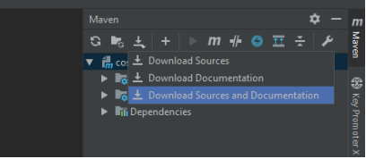
   
4. Установить MySQL сервер. Логин и пароль root. Порт 3306.
   Залогиниться и выполнить скрипт init.sql, который ты найдешь в
   корне проекта.
5. Собрать проект (в терминале: mvn -DskipTests=true clean install)
6. Настроить запуск приложения через Tomcat (если не установлен, то
   можно скачать отсюда):
   6.1 Выбрать Add Configuration... в параметрах запуска:
   
   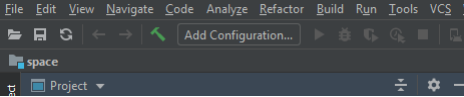
   
   6.2 Нажать на «плюсик» чтобы раскрыть список возможных
   конфигураций. Tomcat может находиться в самом низу. При
   необходимости нажми на «more items».
   
   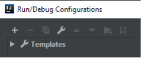
   
   6.3 В выпадающем меню выбрать Local.
   
   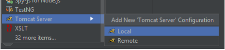
   
   6.4 Во вкладке Server настроить все так, как показано на скриншоте
   (кроме версии Tomcat – используй последнюю):
   
   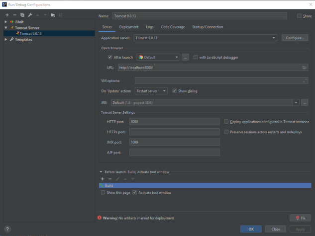
   
   6.5 Во вкладке Deployment нажать на «плюсик» и добавить
   артефакт «cosmoport:war exploded», как указано на скриншоте.
   
   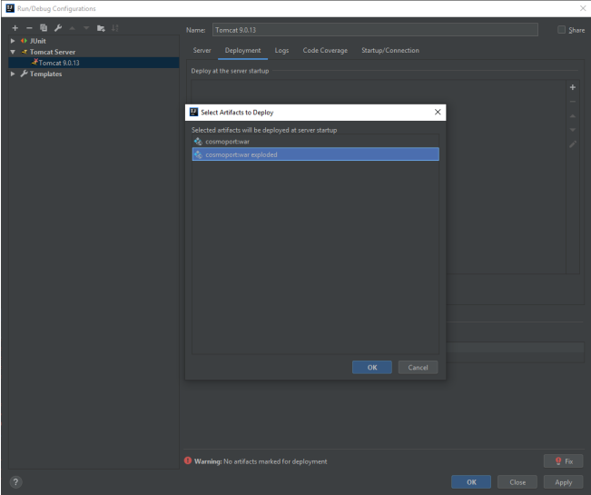
   
   6.6 Очистить поле Application context и нажать Ок:
   
   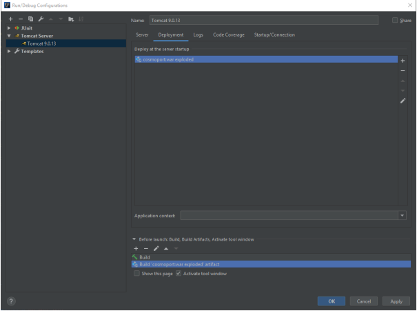
   
7. Запустить приложение. В браузере откроется стартовая страница, на
   которой ты увидишь готовый интерфейс приложения, но он не
   работает пока на сервере нет соответствующего функционала. По
   мере реализации проекта, интерфейс будет правильно отображать
   данные и отправлять запросы на редактирование, удаление и
   создание кораблей.
8. Дописать нужный функционал (см. Задание).
   ВАЖНО: Файл pom.xml изменять нельзя!
9. Протестировать свое приложение с помощью тестов, которые уже
   есть в проекте.
   
10.Если ВСЕ ТЕСТЫ ПРОШЛИ успешно, то задание считается выполненым. ВАЖНО: Файл pom.xml
изменять нельзя!

Задание.

   Нужно дописать приложение, которое ведет учет космических кораблей в
   далеком будущем (в 3019 году). Должны быть реализованы следующие
   возможности:
1. получать список всех существующих кораблей;
2. создавать новый корабль;
3. редактировать характеристики существующего корабля;
4. удалять корабль;
5. получать корабль по id;
6. получать отфильтрованный список кораблей в соответствии с
   переданными фильтрами;
7. получать количество кораблей, которые соответствуют фильтрам.
   Для этого необходимо реализовать REST API в соответствии с
   документацией (см. ниже REST API).
   

   -- В проекте должна использоваться сущность Ship, которая имеет поля:

   Long id - ID корабля

   String name - Название корабля (до 50 знаков включительно)

   String planet - Планета пребывания (до 50 знаков включительно)

   ShipType shipType - Тип корабля

   Date prodDate - Дата выпуска.
   Диапазон значений года 2800..3019 включительно

   Boolean isUsed - Использованный / новый

   Double speed - Максимальная скорость корабля. Диапазон значений
   0,01..0,99 включительно. Используй математическое
   округление до сотых.

   Integer crewSize - Количество членов экипажа. Диапазон значений
   1..9999 включительно.

   Double rating - Рейтинг корабля. Используй математическое
   округление до сотых.

   -- Также должна присутствовать бизнес-логика:

   Перед сохранением корабля в базу данных (при добавлении нового или
   при апдейте характеристик существующего), должен высчитываться
   рейтинг корабля и сохраняться в БД. Рейтинг корабля рассчитывается по
   формуле:
   𝑅 =
   80·𝑣·𝑘
   𝑦0−𝑦1+1
   ,
   
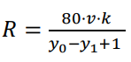

   где:
   v — скорость корабля;
   k — коэффициент, который равен 1 для нового корабля и 0,5 для
   использованного;
   y0 — текущий год (не забудь, что «сейчас» 3019 год);
   y1 — год выпуска корабля.

   -- В приложении используй технологии:
1. Maven (для сборки проекта);
2. Tomcat 9 (для запуска своего приложения);
3. Spring;
4. Spring Data JPA;
5. MySQL (база данных (БД)).
   Вот ссылка на архив с полезными книгами, которые помогут тебе в
   решении тестового задания. Не нужно их все перечитать, используй как
   справочники. 
   https://www.dropbox.com/scl/fi/kxkmbtl2yyqq7f5dbjbyy/Books.rar?rlkey=4k47fsa9q94oojsy19k6ejizf&e=1&dl=0
   
  
   -- Обрати внимание.
1. Если в запросе на создание корабля нет параметра “isUsed”, то считаем,
   что пришло значение “false”.
2. Параметры даты между фронтом и сервером передаются в
   миллисекундах (тип Long) начиная с 01.01.1970.
3. При обновлении или создании корабля игнорируем параметры “id” и
   “rating” из тела запроса.
4. Если параметр pageNumber не указан – нужно использовать значение 0.
5. Если параметр pageSize не указан – нужно использовать значение 3.
6. Не валидным считается id, если он:
- не числовой
- не целое число
- не положительный
7. При передаче границ диапазонов (параметры с именами, которые
   начинаются на «min» или «max») границы нужно использовать
   включительно.
   

   -- REST API. --

Get ships list

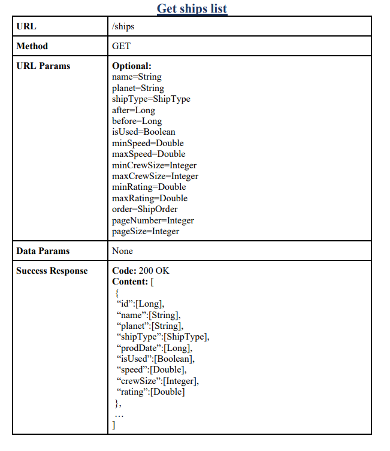
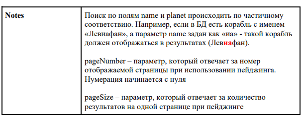

Get ships count

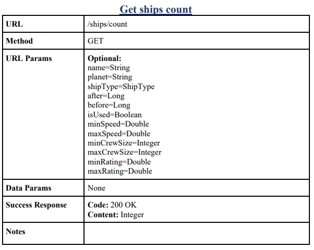

Create ship

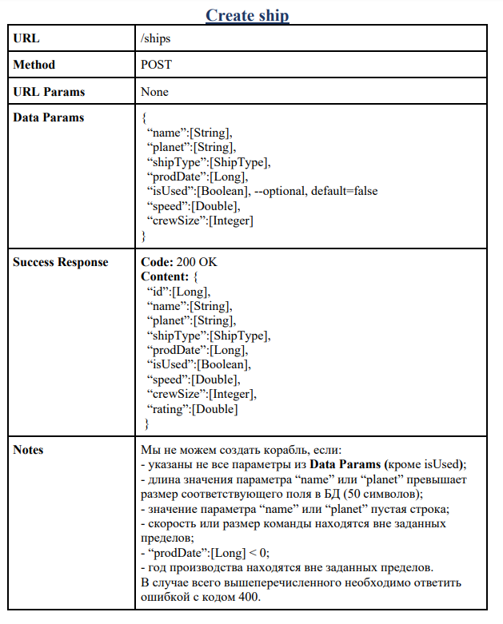

Get ship

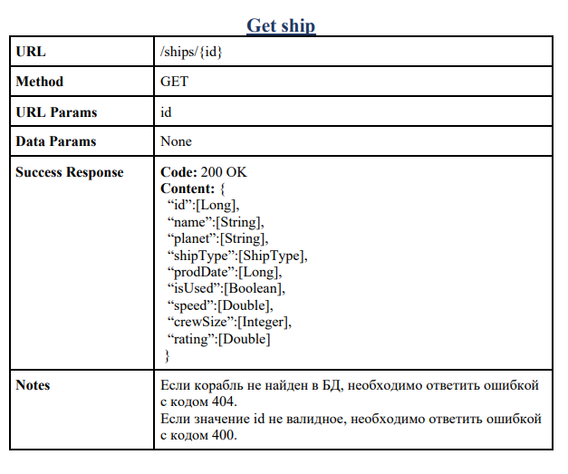

Update ship

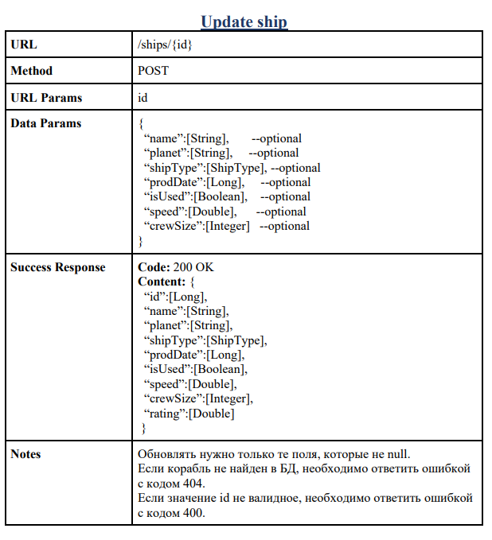

Delete ship

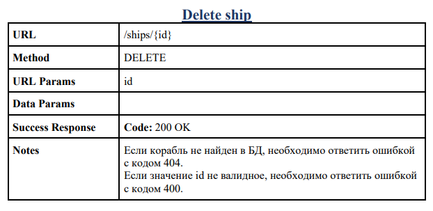
